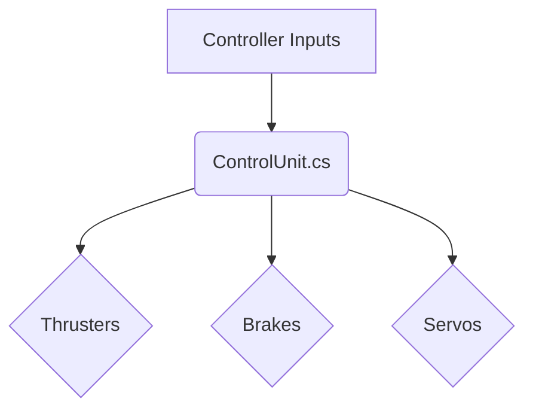

# CosmicMiner

This project is a Unity-based spacecraft simulator where you can design, build, and fly your own spacecraft. This document provides an overview of the project, its structure, and how to get started.

## Getting Started

1.  **Clone the repository:**

    ```
    git clone https://github.com/MK040412/Easy_robot.git
    ```

2.  **Open the project in Unity:**

    *   Launch the Unity Hub.
    *   Click on "Add" and select the cloned repository's folder.
    *   Open the project.

3.  **Explore the `Project1` scene:**

    *   The main scene is located at `Assets/Scenes/Project1.unity`.
    *   This scene contains the spacecraft, the track, and other essential elements.

## Control System

The control system is the heart of the spacecraft, responsible for translating controller inputs into actions. The main script for this is `ControlUnit.cs`, which reads inputs and controls the thrusters, brakes, and servos.

### Control Flow Diagram



### Key Scripts

*   **`ControlUnit.cs`**: This is the central control script. It reads analog and digital inputs and maps them to the spacecraft's actuators.
*   **`ThrusterBehave.cs`**: Manages the thrusters, applying force based on the `controlVal` set by `ControlUnit.cs`.
*   **`BrakeBehave.cs`**: Controls the brakes, applying a drag force to slow down the spacecraft.
*   **`ServoBehave.cs`**: Manages the servos, rotating them to a target angle.

## How to Customize

1.  **Modify the `ControlUnit.cs` script:**

    *   Open `Assets/Script/ControlUnit.cs`.
    *   In the `FixedUpdate` method, you can map your controller's inputs (A0-A5, D2-D6) to the `controlVal` of the thrusters, brakes, and servos.

2.  **Adjust the spacecraft's design:**

    *   In the Unity editor, you can modify the spacecraft's design by adding, removing, or repositioning components.
    *   Make sure to link the new components to the `ControlUnit.cs` script in the Inspector.